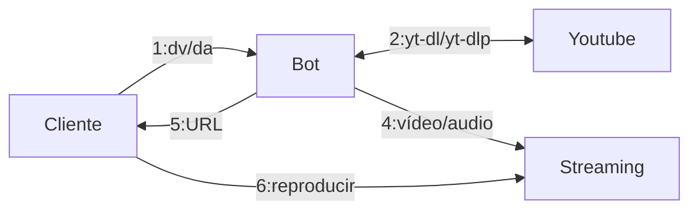

# Proyecto: Implementación de un Bot de Telegram para Streaming Multimedia

## Descripción general

El objetivo del proyecto es implementar un sistema que automatice la
descarga y preparación de contenido multimedia desde YouTube mediante un
bot de Telegram. Este sistema debe permitir el streaming del contenido
descargado a través de servidores configurados específicamente para video
y audio.

---

## Requisitos funcionales

### F1. Bot de Telegram

El bot debe reconocer los siguientes comandos:

- `dv [URL]`: Descargar el vídeo de YouTube indicado y prepararlo para
   streaming con NGINX.

- `da [URL]`: Descargar el audio de YouTube indicado y añadirlo a la lista
  de streaming de Icecast.

El bot debe devolver al usuario un enlace al contenido preparado.

### F2. Streaming de vídeo (y audio) con NGINX

- Configurar NGINX como servidor de streaming de vídeo.

- Convertir el vídeo descargado al formato adecuado (por ejemplo, HLS).

### F3. Streaming de audio con Icecast

- Configurar Icecast para la transmisión de audio.

- Añadir automáticamente los archivos descargados al flujo de streaming.

### F4. Automatización del despliegue

El sistema debe ser implementado en contenedores Docker o en servidores
configurados con Ansible.

---

## Requisitos técnicos

### Lenguaje de programación

Python para el bot (usando librerías como python-telegram-bot o similar).
Naturalmente se pueden utilizar lenguajes alternativos que tengan librería
para telegram (Java, PHP, etc), ver
[ejemplos](https://core.telegram.org/bots/samples).

### Conversión del vídeo o audio

- [ffmpeg](https://www.ffmpeg.org/)

### Herramientas de descarga

- [youtube-dl](https://github.com/ytdl-org/youtube-dl)

- [yt-dlp](https://github.com/yt-dlp/yt-dlp).

### Servidores

- NGINX con módulo RTMP o configuración HLS para vídeo.

- Icecast para streaming de audio.

### Automatización

- Docker para contenedores.

- Ansible para la provisión y configuración de servidores.

### Entorno

- Sistema operativo Linux (Ubuntu o Debian).

---

## Proyecto: Fases

### P1. Diseño y planificación

- Esquema general de la arquitectura del sistema.
- Selección de herramientas y tecnologías.
- Desarrollo del bot de Telegram

### P2. Configuración básica del bot

- Implementación de los comandos "dv" y "da".
- Configuración de los servidores

### P3. Preparación del servidor de streaming de vídeo con NGINX

### P4. Configuración de Icecast para el streaming de audio

### P5. Automatización del despliegue

- Creación de playbooks de Ansible o configuración de Docker Compose para
  desplegar el sistema.

### P6. Pruebas y validación

- Validar el funcionamiento del bot y el acceso a los enlaces generados.
- Comprobar la calidad y estabilidad del streaming.

### P7. Documentación

- Instrucciones de uso del bot.
- Guía para desplegar y configurar el sistema en un entorno nuevo.

### P8. Escalar (opcional)

- Escalar algunos servicios, separándolos (por ejemplo separar el bot de
  la codificación del multimedia), haciendo réplicas con balanceadores
  de carga, kubernetes, terraform, etc.
